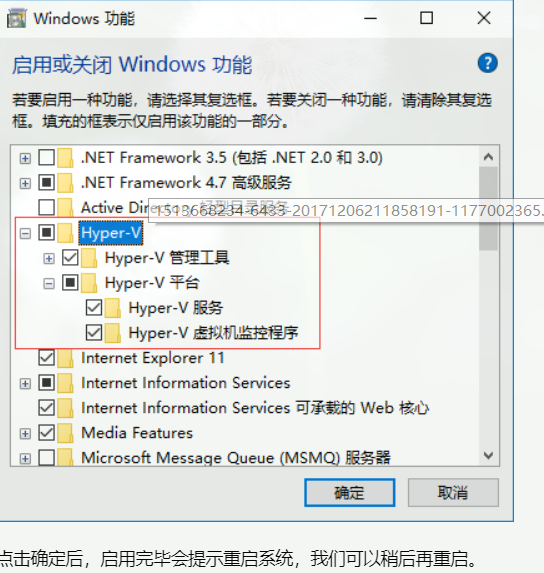
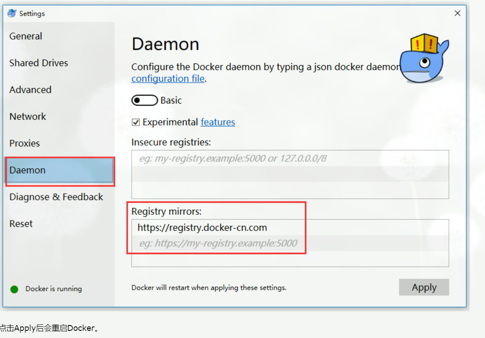

#window10安装docker
打开控制面板 - 程序和功能 - 启用或关闭Windows功能，勾选Hyper-V，然后点击确定即可，如图：

#下载docker
Docker下载地址为：https://store.docker.com/editions/community/docker-ce-desktop-windows 点击如图处即可下载安装包：

#2.更换镜像源地址
 
 https://alzgoonw.mirror.aliyuncs.com
 中国官方镜像源地址为：https://registry.docker-cn.com、http://f1361db2.m.daocloud.io
 
 点击托盘处docker图标右键选择-Settings，然后修改如下：
 
 
 
 3.载入测试镜像测试
 
 输入命名“docker run hello-world”可以加载测试镜像来测试。如图：
 
 
 
# 配置
{
  "registry-mirrors": [
    "https://alzgoonw.mirror.aliyuncs.com"
  ],
  "insecure-registries": [],
  "debug": false,
  "experimental": false,
   "graph":"D:\\linux\\docker-image"
}
 
 如果安装失败
 #更新linux内核
 https://docs.microsoft.com/zh-cn/windows/wsl/wsl2-kernel
 ##可能需要执行一下命令
 cd "C:\Program Files\Docker\Docker"
 ./DockerCli.exe -SwitchDaemon
 
 
 # 查看docker 信息
 docker info
 
#移动docker
wsl --list -v

wsl --export docker-desktop-data "D:\Docker\wsl\data\docker-desktop-data.tar"
 
 wsl --unregister docker-desktop-data
 
  wsl --import docker-desktop-data "D:\Docker\wsl\data" "D:\Docker\wsl\data\docker-desktop-data.tar" --version 2
 
 
 导致虚拟机不可用
 bcdedit /set hypervisorlaunchtype off

#linux 下安装 docker
 uname -a   
 
 yum list installed | grep docker
 yum -y install docker

 systemctl start docker
 
 systemctl status docker
 
 
 #开启docker 的远程访问
 systemctl daemon-reload
 systemctl restart docker
 
 看端口监听
 
 CentOS7还可以通过修改/etc/sysconfig/docker文件中的 OPTIONS来达到同样的目的
 
 OPTIONS='--selinux-enabled -H unix:///var/run/docker.sock -H tcp://0.0.0.0:2375'
 
  iptables -I INPUT -p tcp --dport 2375 -j ACCEPT

 

 
 